# pcb-metrics

Download metrics for [pcb](http://pcb.geda-project.org) from [SourceForge](https://sourceforge.net/projects/pcb/files/?source=navbar).

## pcb-4.x series

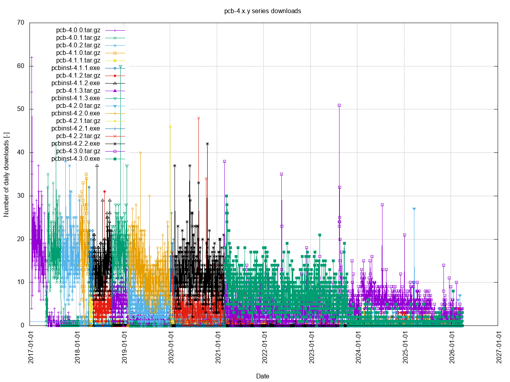

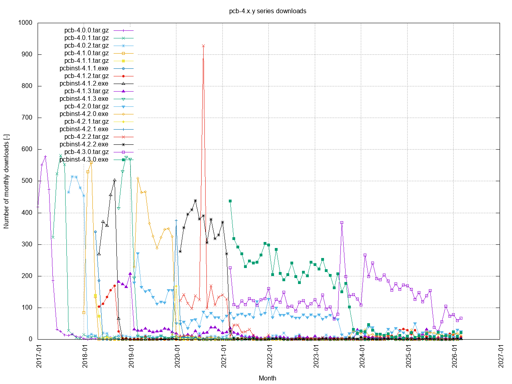

## pcb-4.1.0

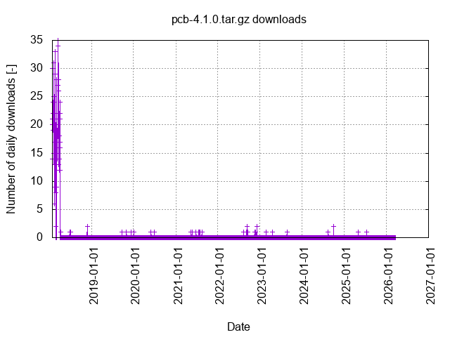

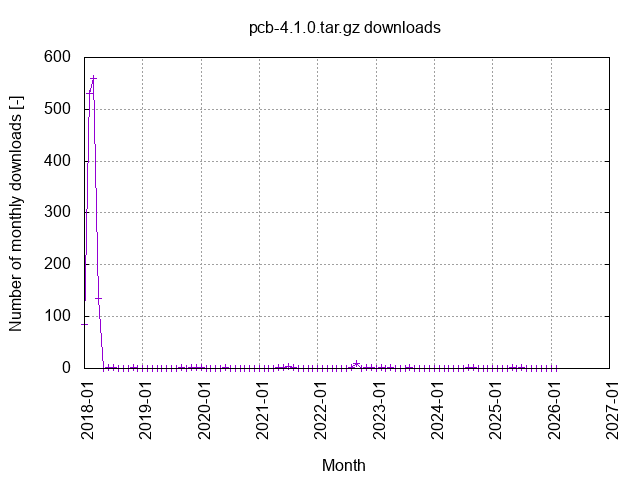

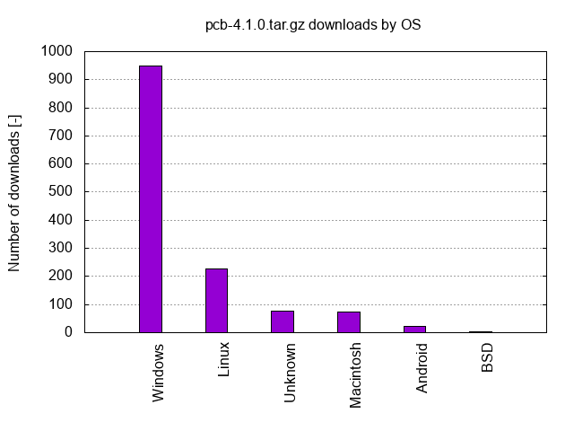

## pcb-4.0.2

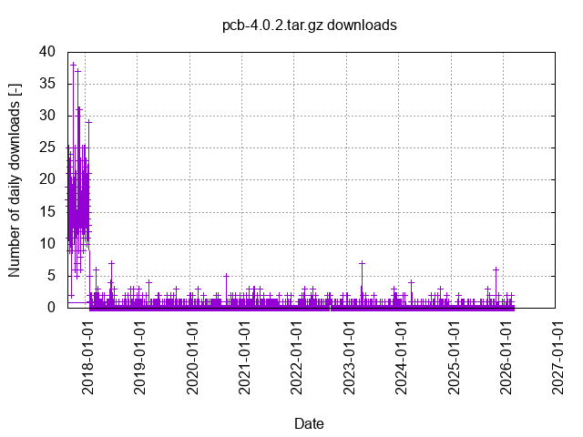

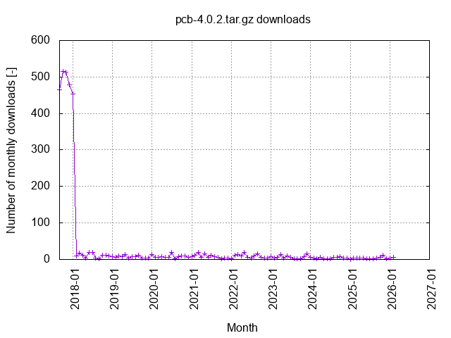

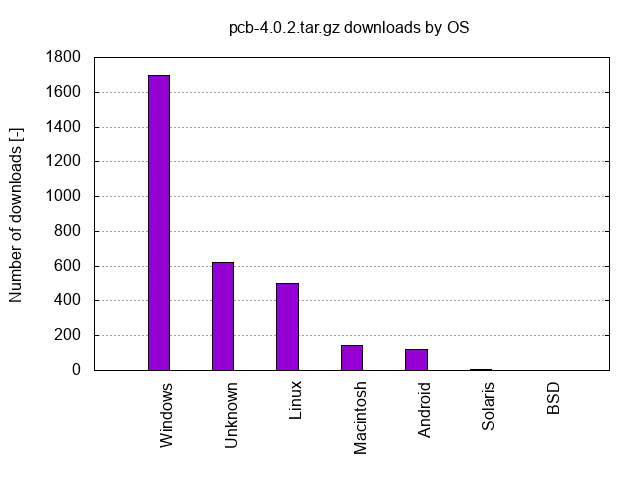

## pcb-4.0.1

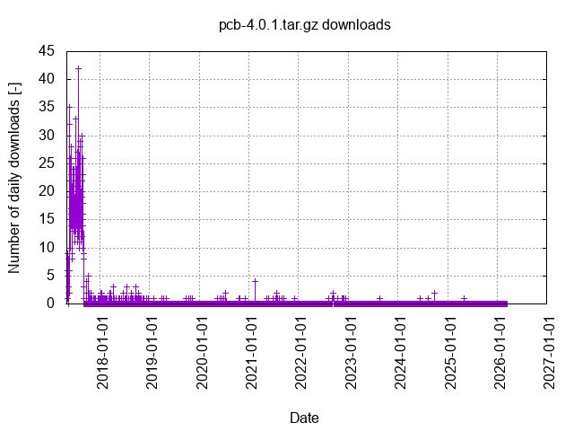

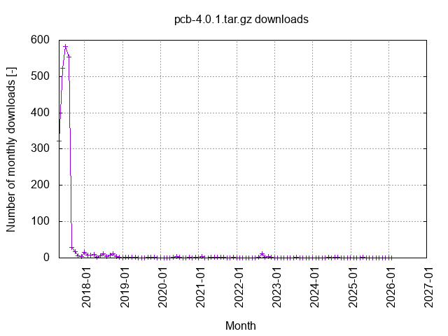

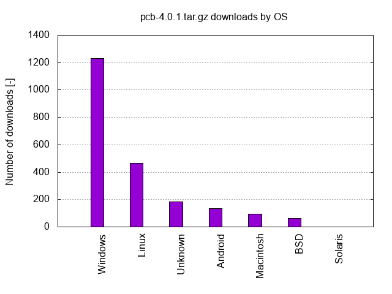

## pcb-4.0.0

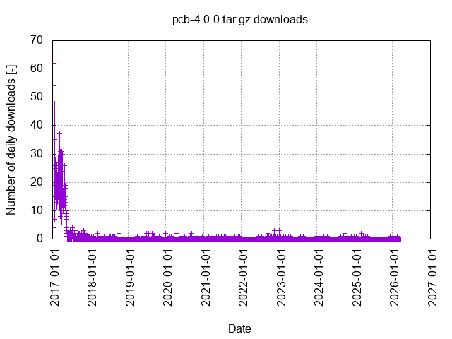

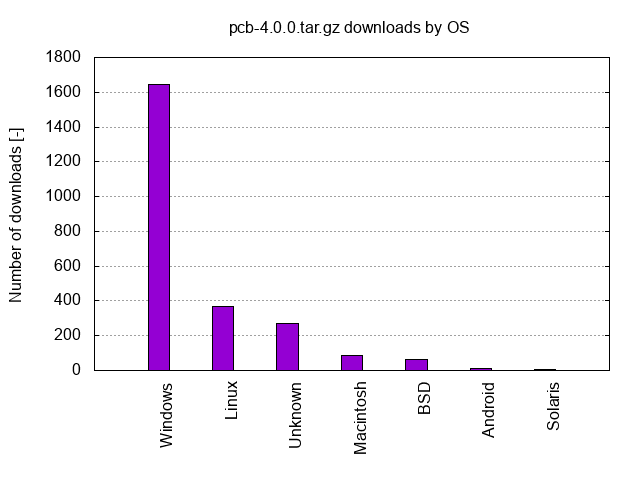

## pcb-20140316

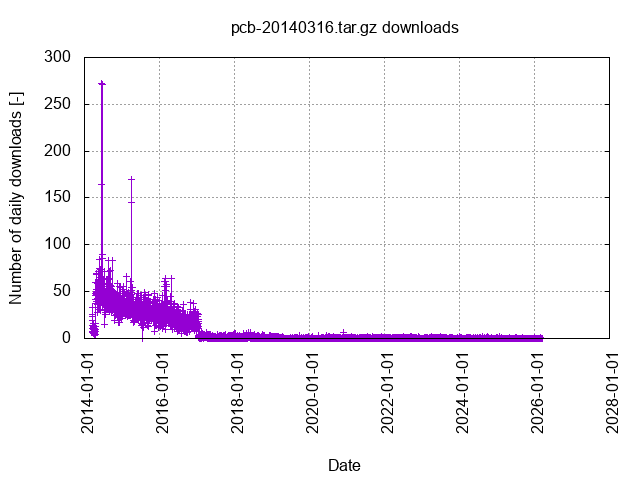

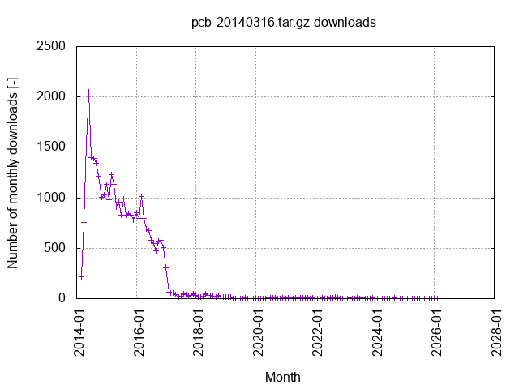

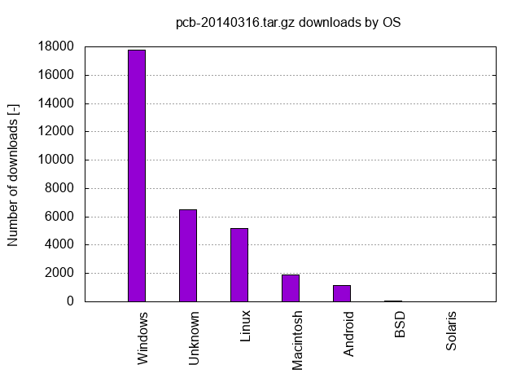

## pcb per release downloads

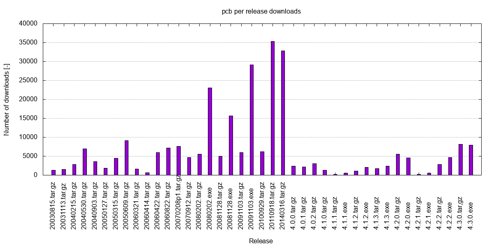

(last update on 2018-03-22)
