# pcb-metrics

Statistical metrics for the pcb git repository can be found [here](http://ljh4timm.home.xs4all.nl/gaf/pcb-gitstats/index.html).

Download metrics for [pcb](http://pcb.geda-project.org) from [SourceForge](https://sourceforge.net/projects/pcb/files/?source=navbar).

## pcb-4.x series

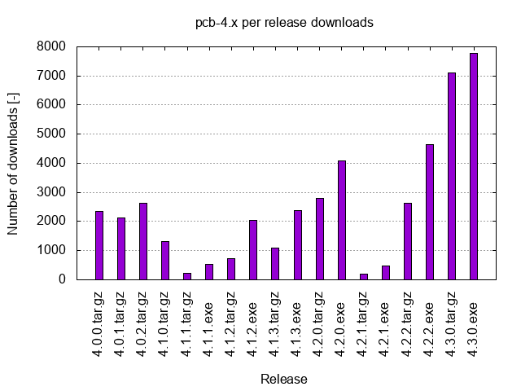

## pcbinst-4.1.3.exe

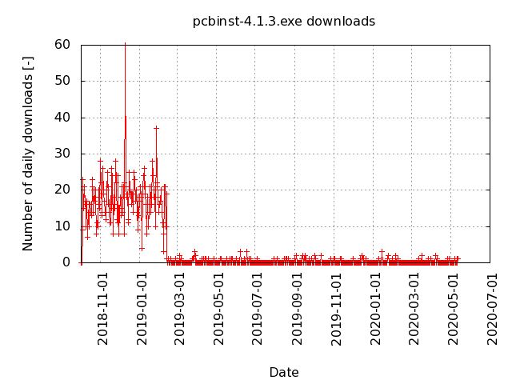

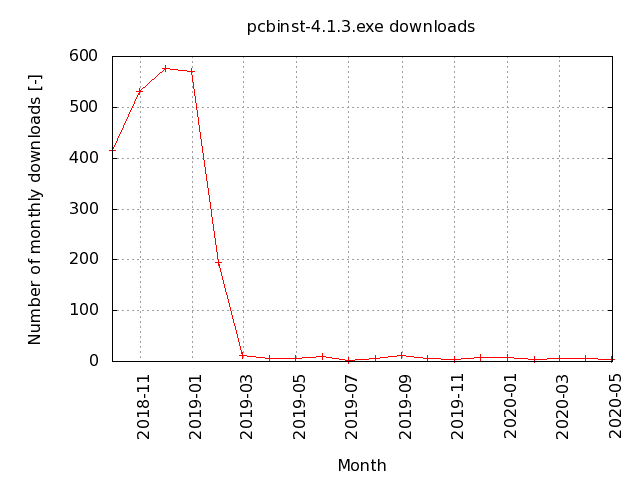

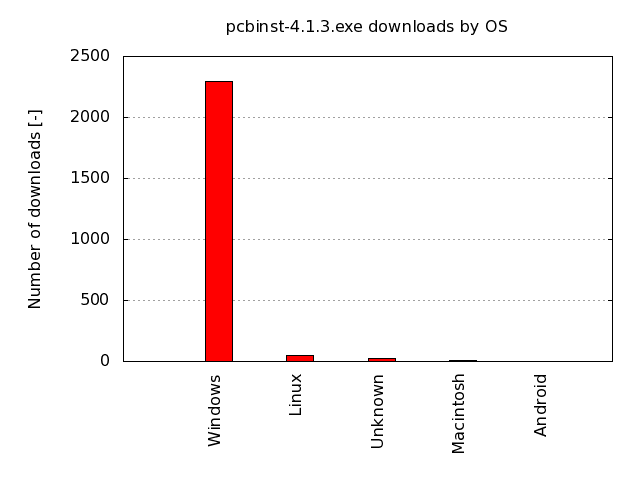

## pcb-4.1.3.tar.gz

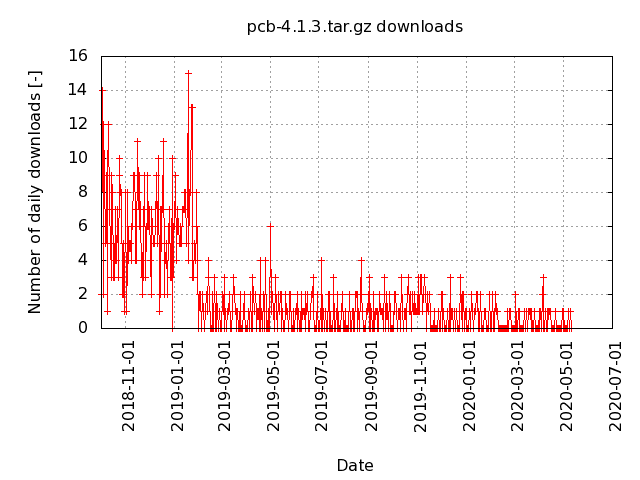

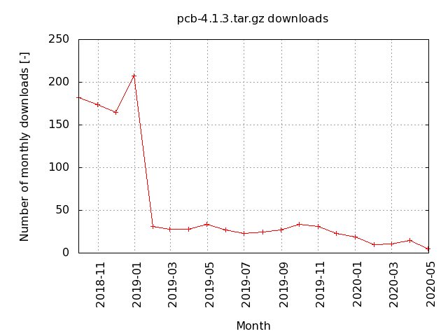

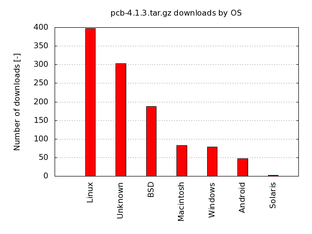

## pcbinst-4.1.2.exe

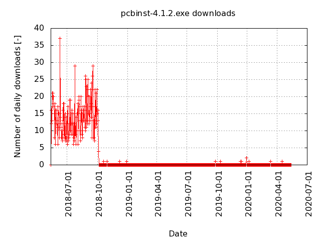

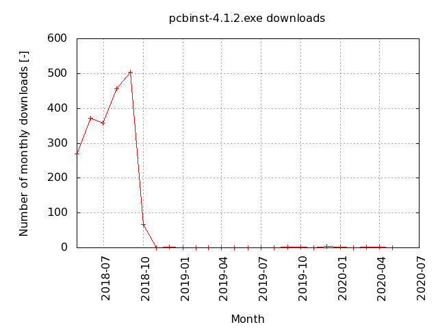

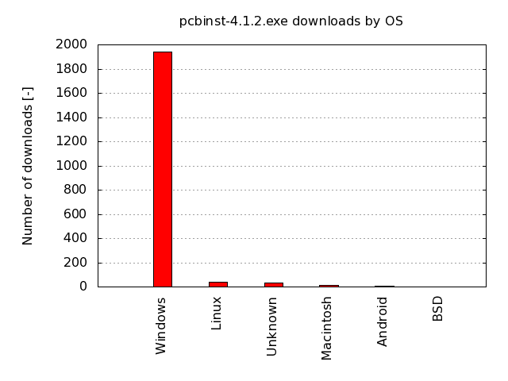

## pcb-4.1.2.tar.gz

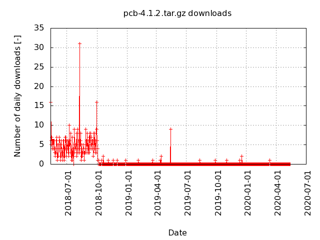

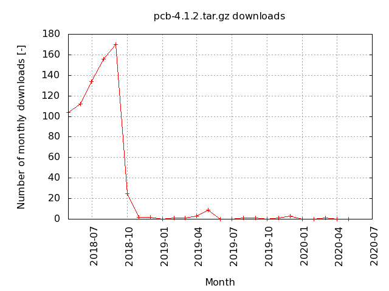

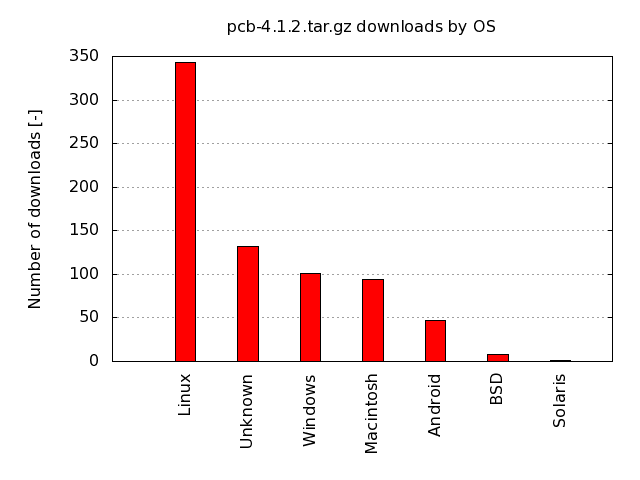

## pcbinst-4.1.1.exe

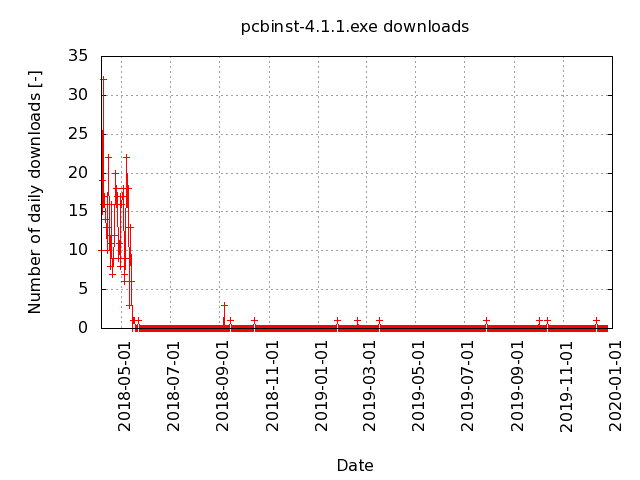

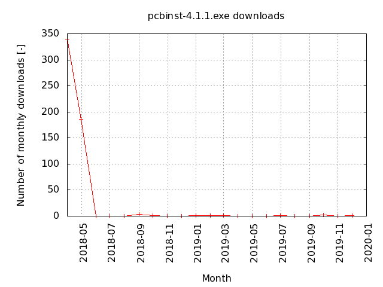

## pcb-4.1.1.tar.gz

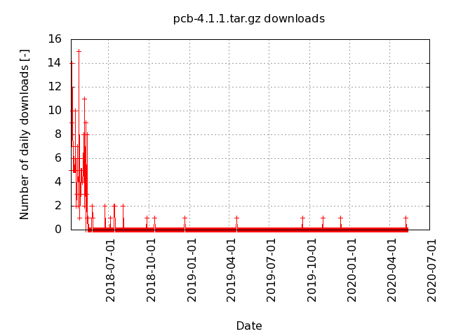

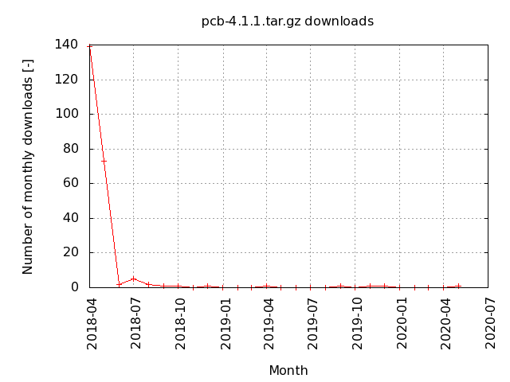

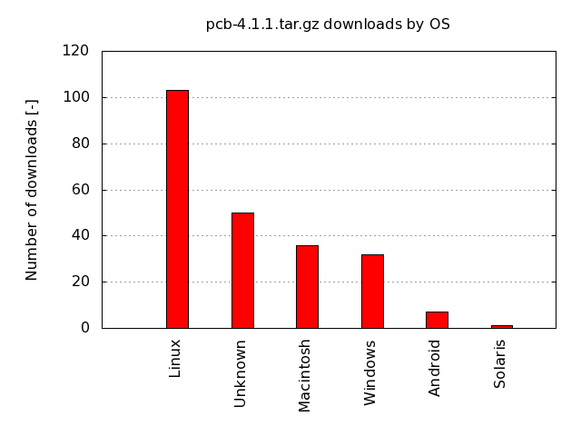

## pcb-4.1.0.tar.gz

## pcb-4.0.2.tar.gz

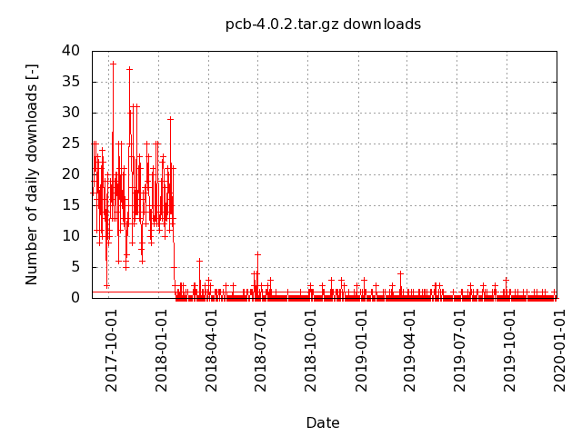

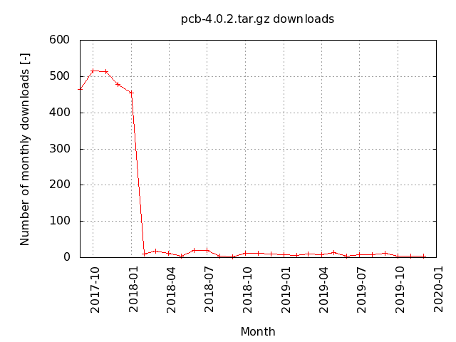

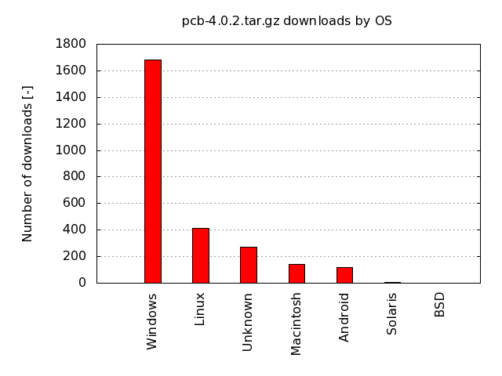

## pcb-4.0.1.tar.gz

## pcb-4.0.0.tar.gz

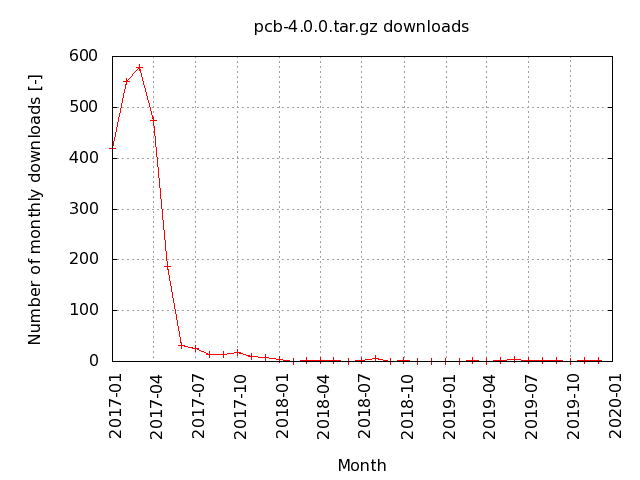

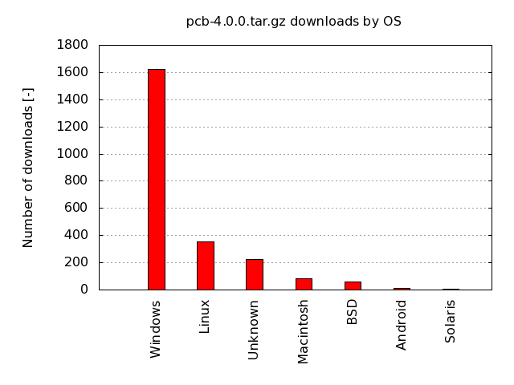

## pcb-20140316.tar.gz

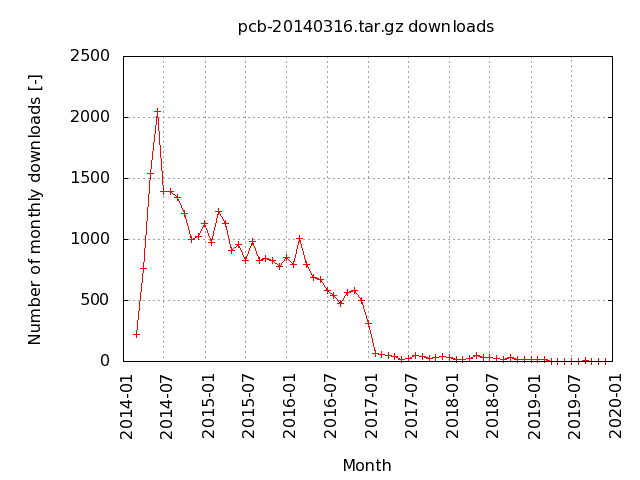

## pcb per release downloads

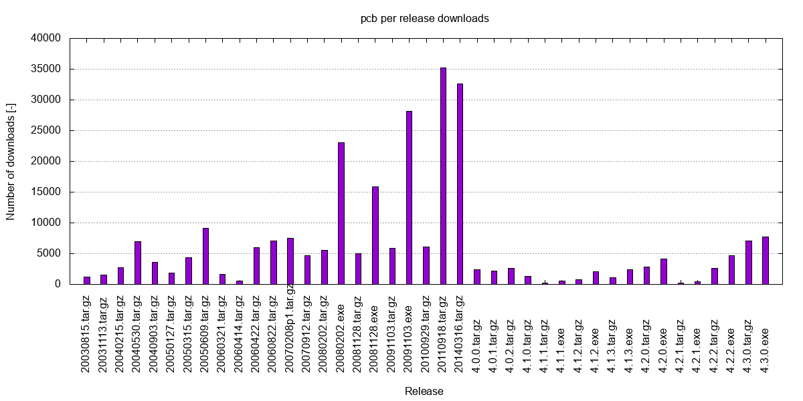

(data last updated on 2018-06-09)
